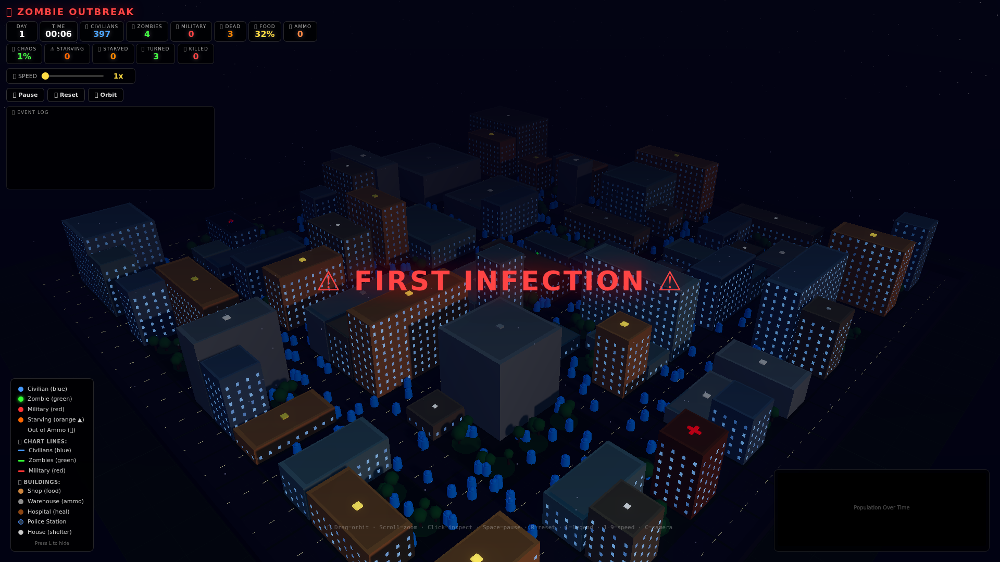

# 🧟 Zombie Outbreak Simulator

**A 3D real-time zombie outbreak simulation in your browser.**

A city of 400 civilians, one zombie patient zero, and everything spiralling from there. Procedural city generation, emergent AI, and a surprisingly tense simulation of societal collapse.



## 🎮 Features

### Live Simulation
- **400+ individuals** with layered AI — civilians seek food & shelter and flee zombies, zombies hunt in hordes, military deploys in coordinated squads
- **Day/night cycle** with dynamic sky gradient, stars, moon, building window glow, and fog that adapts to camera zoom
- **Food economy** — finite food per building. Civilians must forage at shops/warehouses. Food depletes city-wide. Starvation is a real threat.
- **Ammo economy** — finite ammo per building. Military starts with 50 rounds, must resupply at police stations or warehouses.
- **Infection system** — bite resistance (65% chance to shrug it off, take 25 damage instead of turning), instant turning on failed save
- **Zombie aggro** — visual range 16u (requires line of sight), audio aggro 25u from gunshots (no LOS needed). Zombies are 1.6x faster at night, sprint when close.
- **Sprint system** — civilians can sprint when a zombie is within 14u, limited duration, cooldown-dependent (longer if hungry)
- **Horde grouping** — zombies within 5u of each other cluster into hordes; older zombies drift toward horde centers
- **Military squads** — deploy in waves, squad members stay within 5u, non-leaders follow the leader, squad-wide engagement trigger
- **5-phase outbreak system** — escalating phases from containment through extinction, each announced with radio messages
- **5 intro scenarios** — randomised each run (meteor crash, lab leak, infected cargo, ancient spores, space signal)
- **Radio messages** — periodic HQ broadcasts that escalate in panic as the outbreak worsens
- **Slow-motion first infection** — time slows to 30% for 3 seconds on first bite, with a screen flash

### Combat

| Mech | Detail |
|------|--------|
| **Civilian vs Zombie** | Bite range 1.3u. 65% resist chance (take 25 dmg), 35% turn chance. Civilians can survive 4 bites. |
| **Military vs Zombie** | Range up to 25u. Aim takes 0.01-0.3s. Hit chance = 93% - distance × 1.4 (caps at 30%). Zombies have 30 HP. One hit = one kill. |
| **Military vs Zombie (miss)** | 55% miss chance at max range. Tracers show hit (solid red) vs miss (dashed red). Misses still alert zombies. |
| **Line of sight** | Buildings block shots. Military moves closer if LOS is blocked. Zombies need LOS for visual aggro. |
| **Reload** | 2-second reload when magazine empty. Military carries 50-round mags with large reserve. |
| **Resupply** | Military returns to ammo buildings when total ammo < 30. Also grabs food from the building. |
| **Audio aggro** | Gunshots alert all zombies within 25u, aggro lasts 5 seconds, draws them to the shooter's position. |

### Visuals
- **UnrealBloomPass** for atmospheric bloom glow
- **Distinct entity shapes** — cylinders (civilians = blue), cones (zombies = green), boxes (military = red)
- **Building roof colors** by type with sync'd legend
- **Occupancy dots** — small blue dots on roofs = people inside
- **Blood pools** — red circles on ground where entities die, fade over 20s
- **Corpses** — blood pools from starved civilians and killed zombies (events push `CORPSE:x,z` to renderer)
- **Military tracers** — solid red line = hit, dashed red line = miss, fade over 2s
- **Particle effects** — ambient particles with 1,600 particles, spawned at zombie deaths
- **Night overlay** — semi-transparent dark plane maps over the scene at night
- **Moon** — visible at night, rises and sets with sky gradient
- **Ground** — subtle vertex color variation, grid overlay texture
- **Fog density** adapts to camera distance

### UI: HUD
- **13 stat boxes** — DAY, TIME, CIVILIANS, ZOMBIES, MILITARY, DEAD, CHAOS, STARVING, STARVED, TURNED, KILLED
- **Chaos meter** — green (<40%), yellow (40-70%), red (>70%). Calculated from zombie-to-survivor ratio, death toll, and zombie population.
- **Stat box alerts** — zombie counter pulses red when zombies outnumber survivors
- **Population chart** — canvas line graph (civilians blue fill, zombies green fill, military red line). Auto-scales to max population.
- **Event log** — scrollable feed with type-colored entries (zombie/green, death/red, info/white, warning/yellow, military/magenta). Auto-scrolls.
- **Death breakdown** — separate counters for starved, turned, and killed by military
- **Speed slider** — 0.5x to 100x simulation speed

### UI: Notifications & Overlays
- **Slide-in notifications** — auto-dismiss after 3.5s. Types: zombie (green), death (red), info (blue), military (purple).
- **Milestones** — popup alerts at key thresholds: first zombie, 50/100/200 zombies, 50/10 civilians remaining, Day 5/10 survival
- **Danger overlay** — red pulsing border when zombies > survivors (and zombies > 5)
- **First infection slow-mo** — time slows to 30% for 3 seconds with "⚠ FIRST INFECTION ⚠" flash overlay
- **Game over screen** — animated overlay with outcome text. Green border for victory, red for loss.
- **Entity popup** — click any entity to see ID, type, HP, state, kills (military), ammo (military), hunger (civilian)
- **Legend panel** — visible by default, shows entity colors/shapes, building types, people dots, starving indicator, out-of-ammo indicator

### Controls
| Key | Action |
|-----|--------|
| `Space` | Pause / Resume |
| `R` | Reset simulation (generates new map + scenario) |
| `C` | Cycle camera mode (orbit → top → close) |
| `L` | Toggle legend |
| `←` `→` | Pan camera horizontally |
| `↑` `↓` | Pan camera vertically |
| `1`-`9` | Set speed multiplier |
| `0` | Set speed to 10x |
| Click | Inspect entity |
| Drag | Orbit camera |
| Scroll | Zoom |

A hint bar appears at the bottom and auto-fades after 8 seconds.

## 🚀 Quick Start

```bash
npm install
npm run dev
# opens at http://localhost:5173
```

## 🎯 How It Works

### Entity Types
| Type | Shape | Base HP | Speed | Behavior |
|------|-------|---------|-------|----------|
| **Civilian** 🟦 | Cylinder (blue) | 100 | 3.5-4.5 | Wanders, seeks food when hungry (hunger <45), sleeps in buildings at night (fatigue >60), starves when hunger <25, flees from zombies, can sprint when threatened |
| **Zombie** 🟩 | Cone (green) | 30 | 3.5-4.5 (2.5-3.25 if turned) | Hunts nearest human (visual 16u, audio 25u), 1.6x faster at night, sprints when within 5u of target, clusters into hordes, drifts toward horde centers after 5s old |
| **Military** 🟥 | Box (red) | 100 | 3.5-4.25 | Deploys in squads when threat detected, 50-round mags, resupplies when ammo <30, aims 0.01-0.3s before firing, accuracy drops with distance |

### Entity States (state machine)

**Civilians:** `wandering` → `foraging` (when hungry near food) → `starving` (hunger <25) → `seeking_shelter` → `sleeping` (at night, in buildings) / `hiding` (day, from zombies) → `fleeing` (zombie within 8u) → `dead` (hunger ≤ -10 or HP ≤ 0)

**Zombies:** `hunting` (always) → `attacking` (within 1.3u) → `feeding` (2s after bite) → `hunting` again

**Military:** `patrolling` (no zombies in 25u) → `engaging` (zombie in range) → `reloading` (mag empty) → `resupplying` (ammo <30) → `hiding` (>2 zombies within 8u AND ammo <5) → `sleeping` (night, fatigue >80)

### Survivor Mechanics

| Mechanic | Detail |
|----------|--------|
| **Hunger** | Drains at 0.5/s. Hunger <45 → seek food. Hunger <25 → starving state. Hunger ≤ -10 → death. |
| **Fatigue** | Builds at 0.15/s. Fatigue >60 at night → seek shelter. Sleeping restores at 3.0/s. |
| **Foraging** | Enters a food building, consumes 8-18 food from it after short timer. Building food is finite and shared. |
| **Starvation recovery** | Starving civilian reaching a food building immediately consumes 5 food and restores hunger to 80. |
| **Sprinting** | Triggered when zombie within 14u. Duration = 2-3.5s (halved if hungry). Cooldown = 3-5s (doubled if hungry). Speed = 3.5× normal. |
| **Panic flee** | Zombie within 8u → flee for 4-6s. Bitten at <1.3u → 65% resist (take 25 dmg) / 35% turn. |
| **Hiding** | Zombie within 5u → try to enter nearest building. Hide for 3-7s. Come out if zombie leaves 14u range or hunger <25 forces it. |

### Zombie Mechanics

| Mechanic | Detail |
|----------|--------|
| **Visual aggro** | 16u range, requires line of sight |
| **Audio aggro** | 25u range, triggers from gunshots, LOS not required, lasts 5s |
| **Night speed** | 1.6× multiplier |
| **Sprint chase** | Within 5u of target → 1.6× speed multiplier |
| **Horde clustering** | Zombies within 5u of each other (3+) form a horde. Zombies >5s old drift toward nearest horde center. |
| **Bite mechanic** | 1.3u range, 0.5s cooldown. 65% resist (civilian loses 25 HP), 35% instant turn. Military: one-hit kill. |
| **Feeding** | 2s pause after a bite before resuming hunt |
| **Building avoidance** | Cannot enter buildings. Pushes out with sliding physics along the closest wall face. Pre-emptive wall steering. |
| **Shelter protection** | Cannot bite civilians who are inside buildings (hiding, sleeping, seeking shelter, foraging) |

### Military Mechanics

| Mechanic | Detail |
|----------|--------|
| **Deployment** | Scales with total threat (zombies + turned). Starts at 3 soldiers, ramps to 14 at threat ≥280, then drops to 12 at ≥360. Capped at zombies×0.5+2. |
| **Squads** | Soldiers share a squad ID. Non-leaders follow the leader. Squadmates stay within 5u. Whole squad switches to engaging when one fights. |
| **Combat range** | Optimal 8-14u. Backpedals when zombie <10u, retreats full speed when <6u, advances when >15u. |
| **Accuracy** | Hit% = 93 - distance×1.4 (min 30%). At 5u = 86%, at 15u = 72%, at 25u = 58%. |
| **Aim time** | 0.01-0.3s. Slows movement while aiming (velocity × 0.88). |
| **Reload** | 2s reload when magazine empties. Draws from reserve ammo. |
| **Resupply** | Returns to nearest warehouse/police station when total ammo <30. Consumes up to 60 ammo from building. Also grabs up to 10 food. |
| **Hiding** | Hides in nearest building when >2 zombies within 8u AND ammo <5. Restores ammo at 0.5/s from hidden reserves. Exits when ammo >10 OR no zombies within 15u. |
| **Civilian protection** | Moves toward zombies that are within 5u of civilians in 12u range. |
| **Line of sight** | Advances for a clear shot if a building blocks LOS. Uses raycasting with 0.5u step sampling. |
| **Audio aggro** | Every shot alerts ALL zombies within 25u of the shooter for 5s. |

### Building Types

| Building | Roof Color | Food | Ammo | Function |
|----------|-----------|------|------|----------|
| **Shop** | 🟡 Yellow | 30 | 5 | Primary food source |
| **Warehouse** | ⚫ Dark Gray | 50 | 20 | Ammo + food resupply |
| **House** | ⚪ White / Brown | 15 | 0 | Shelter (sleeping, hiding) |
| **Office** | 🔵 Gray | 10 | 0 | Food (low), shelter |
| **Apartment** | 🔵 Slate Blue | 10 | 0 | Shelter |
| **Police** | 🔵 Dark Blue | N/A | 200 | Primary ammo source, limited shelter |

- **Occupancy**: blue dots on roofs show people inside. Baked into building meshes by the renderer.
- **Window glow**: builds emit warm light from windows at night, visible through bloom.

### Procedural City
- 60×60 unit map, 3-unit grid cells
- 20×20 grid: roads every 4 cells (grid pattern), buildings fill the rest
- 25% of building cells are parks (with trees + bushes)
- Contiguous building cells merge into larger buildings
- 1-5 floors random height
- Police station replaces a building near map edge
- Buildings sorted for road adjacency validation
- Parks have randomly placed trees (2-5 per park) with slight position jitter

### Phases
| Phase | Zombie % | Label | Message |
|-------|----------|-------|---------|
| 0 | <10% | Containment | "Outbreak localized" |
| 1 | 10-40% | Spread | "Infection crossing containment zones" |
| 2 | 40-70% | Explosion | "Rapid transmission! City in chaos!" |
| 3 | 70-90% | Collapse | "Civilization breaking down!" |
| 4 | >90% | Extinction | "Extinction-level event imminent" |

Each phase triggers once per day. Over 90% zombies = permanent panic radio messages.

### Game Over Conditions
| Condition | Result |
|-----------|--------|
| All civilians dead, zombies still alive | 💀 Zombies win |
| All civilians dead, zombies also dead | 💀 No survivors |
| All zombies eliminated, civilians alive, Day >2 | 🎉 City saved |

### Endgame Scenarios (radio messages)
- **Normal**: HQ status reports, evacuation routes, containment orders
- **Panic** (zombie:survivor ratio >2:1 AND zombies >30): Code Red, air support requests, contamination warnings
- **Victory** (ratio <0.3:1 AND military present): Infection slowing reports, reduced activity

### Milestones (notifications)
- First zombie spotted
- 50 / 100 / 200 zombies
- 50 / 10 civilians remaining
- Survival to Day 5 / Day 10
- City saved (linked with game over)

### Chaos Calculation
```
CH = min(100, (zomb / max(1, civ + mil)) × 60 +
          (dead > 50 ? 20 : dead > 20 ? 10 : 0) +
          (zomb > 100 ? 20 : zomb > 50 ? 10 : 0))
```
Displayed as 0% when zombies ≤ 10.

## 💡 Tips
- Speed up to **5-20x** during quiet periods — the early game is slow
- Let it run to **Day 2** for military deployment
- Click entities to inspect their stats (military ammo, civilian hunger)
- Press **L** to see the legend
- Zombies are **1.6x faster at night** — Day 3+ nights get intense
- Military has **50 rounds** but needs to resupply at police stations and warehouses
- Starving civilians move **50% slower** — get them to food buildings fast
- A single shop has **30 food** — enough to feed about 3-4 civilians from starving
- The police station has **200 ammo** — critical for sustained military operations
- Zombies can't bite civilians who are inside buildings — shelter is real protection
- Gunshots alert every zombie within 25u — firing draws the horde

## 🛠️ Tech Stack
- **[Three.js](https://threejs.org/)** — 3D rendering (OrbitControls, Raycaster)
- **[Vite](https://vitejs.dev/)** — Build tool
- **[TypeScript](https://www.typescriptlang.org/)** — Type safety
- **EffectComposer + UnrealBloomPass** — Post-processing bloom
- **Canvas API** — Population chart rendering
- **[Vitest](https://vitest.dev/)** — Testing with v8 coverage

## 📁 Structure
```
zombie-sim/
├── src/
│   ├── simulation.ts   # Core AI, combat, food economy, infection, military deployment, phases, radio messages
│   ├── renderer.ts     # Three.js scene, entity meshes, bloom, blood pools, tracers, particles, day/night cycle
│   ├── main.ts         # Game loop, HUD, chart, event log, notifications, milestones, controls, entity popup
│   ├── world.ts        # Procedural city generator (roads, buildings, parks, police station)
│   └── style.css       # All UI styles (HUD, notifications, legend, game over, danger overlay, popup)
├── index.html
├── package.json
└── vite.config.ts
```

## 🧪 Testing
```bash
npm test                # Run unit tests
npm run test:coverage   # With coverage report
npm run test:mobile     # Mobile viewport tests (Playwright)
```

## 📝 License
MIT
