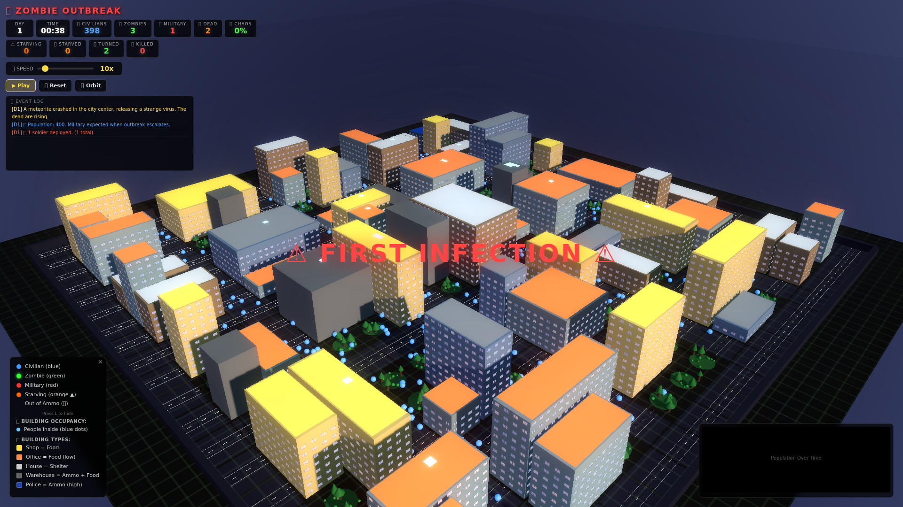

# 🧟 Zombie Outbreak Simulator

**A 3D real-time zombie outbreak simulation in your browser.**

A city of 400 civilians, a zombie patient zero, and everything spiralling from there. Procedural city generation, emergent AI — just watch the collapse unfold.



## ✨ New in v6.1 — More Observable Features

### 📦 Supply Crates — Better Collection
Bug fix: civilians can now collect from crates that have only food OR only ammo remaining (previously required both). Crates also deactivate immediately when fully depleted instead of waiting for the 30s timeout.

### 🧟 Zombie Horde Clustering
Zombies within 5 units of each other form hordes (2+). All zombies gravitate toward the nearest horde center. Military patrols toward the largest horde cluster. This creates natural zombie fronts that sweep across the city.

### 🎯 Military Perimeter Reports
When 5+ soldiers are deployed and zombie count is between 5 and 60, squads periodically report their status every 10-15 seconds. These pure-flavour event log entries make the military feel alive:
- 🎯 Squad holding position reports
- 🔫 Contact reports with zombie clusters
- ⚠️ Fire support requests

### 💥 Panic Chain Reaction
When a civilian dies (turns into a zombie or starves to death), nearby civilians within 5 units enter a panic state — they start sprinting away with extra speed for 3-5 seconds. This creates visible "shockwave" cascades through the civilian population as death ripples through the crowd.

## ✨ New in v6 — Observable Features

### ⭐ Hero Civilian
Each civilian accumulates survival time. The one who has survived the longest is marked with a golden ★ star floating above them. When the hero falls, a special event is logged. Watch your champion fight for survival!

### 👑 Alpha Zombie
The zombie with the most bite attempts earns the alpha crown (red 👑 sprite). The alpha is the most dangerous zombie — the one doing the most damage. When the military finally takes them out, a dramatic event confirms the kill.

### 📡 Random World Events
Periodic atmospheric events fire every 15-40 seconds of game time, visible in the event feed. No gameplay impact — pure flavour:
- 🛩️ Military cargo planes overhead
- 💥 Distant explosions
- 📡 Shortwave broadcasts
- 🔥 Smoke rising from buildings
- 🎆 Signal flares
- 📻 Convoy radio intercepts
- 🌙 Moon breaking through clouds

### 📦 Supply Drone Drops
Military periodically airdrops supply crates into the city. Each crate:
- Falls with a parachute (white canopy + four suspension lines)
- Contains food and ammo for nearby civilians
- Attracts zombies who cluster around the activity
- Fades after 30-35 seconds
- Visually rendered as a wooden box with orange ground glow ring

### Legend Updates
The legend (press L) now includes:
- ⭐ Hero Civilian (golden star)
- 👑 Alpha Zombie (red crown)
- 📦 Supply Crate (parachute drop)

## 🌍 Simulation Features

### Population & AI
- **400+ individuals** with layered autonomous AI — civilians seek food & shelter and flee zombies, zombies hunt relentlessly with no bite cooldown, military deploys in coordinated squads
- **Day/night cycle** with dynamic sky gradient, stars, moon, building window glow, and fog that adapts to camera zoom
- **Food economy** — finite food per building. Civilians forage at shops/warehouses with a cooldown to prevent camping. Food depletes city-wide. Starvation is a real threat.
- **Ammo economy** — finite ammo per building. Military uses 100-round magazines, fires at 0.4s per shot, and must resupply at police stations or warehouses.
- **Infection system** — no HP, no resist. One bite = 6-10s turn timer, then conversion to zombie. Bitten civilians emit a green mist cloud and their body shifts from blue to green as the timer counts down. Skull icon pulses above them, flashing faster as conversion nears.
- **Zombie aggro** — visual range 10 units (requires line of sight), audio aggro 18 units from gunshots (no LOS needed). Zombies alert nearby zombies when they bite someone, producing a visible expanding green ring pulse.
- **Zombie speed** — 2.0–3.0 at day (slower than civilians), 1.5× chase multiplier. Zombies are always hunting with no bite cooldown.
- **Sprint system** — civilians sprint when a zombie is within 14 units, limited duration (2-4s) with cooldown
- **Zombie horde clustering** — zombies within 5 units of each other (2+) form hordes; all zombies drift toward horde centers
- **Military squads** — deploy immediately based on zombie count, scaling at zombies×0.95 + 10. 5 soldiers per wave with 0.3s wave cooldown. Squad members stay within 6 units, all engage if one fights.
- **Military patrols toward hordes** — soldiers pathfind to the largest zombie cluster. Military does not sleep or hide in buildings — they patrol and fight continuously.
- **1 initial rapid-response soldier** — deployed near city centre before any zombies turn
- **Civilians flee toward military** — when panicking, civilians run toward other civilians AND nearby soldiers for protection
- **5-phase outbreak system** — escalates from containment through extinction, each phase announced with a radio message
- **5 intro scenarios** — randomised each run (meteor crash, lab leak, infected cargo, ancient spores, space signal)
- **Periodic radio messages** — HQ broadcasts that become more panicked as the outbreak worsens
- **Slow-motion on first infection** — time slows to 30% for 3 seconds with a screen flash

### Combat System (entirely autonomous)

| Detail | How It Works |
|--------|-------------|
| **Civilian vs Zombie** | Bite at 1.3 units. No cooldown — zombies bite immediately on contact. 100% infection — no resist, no HP. Bitten civilian gets an 8–14 second turn timer and flees in panic toward military/other civilians, then turns into a zombie. |
| **Military vs Zombie** | Engagement up to 25 units. Aim takes 0.1–0.25s. Accuracy = 88% − distance × 1.2 (min 15%). Fire rate: 0.3s. One hit = one kill. Proper LOS check (cannot shoot through buildings). Advances at 1.2× speed to clear blocked LOS. |
| **Turn timer** | Bitten civilians take 8–14 seconds to turn. During this window they emit green mist particles, change colour blue→green, and can be killed by military as civilians. |
| **Zombie call-out** | When a zombie bites someone, nearby zombies (within 15 units) are alerted, shown as an expanding green ring. |
| **Line of sight** | Buildings block shots and visual detection. Military advances if LOS is blocked. Zombies also need LOS for visual aggro. |
| **Reload & Resupply** | Military reloads (2s) when magazine is empty, returns to warehouses/police stations when total ammo drops below 30. Also collects food during resupply. |
| **Audio aggro** | Gunshots alert every zombie within 18 units for 5 seconds, regardless of line of sight. |

### Visuals
- **UnrealBloomPass** for atmospheric glow
- **Entity shapes** — cylinders (civilians blue), cones (zombies green), boxes (military red)
- **Bitten civilians** — colour shifts blue→green over 6-10s, ☠ skull sprite pulses above them, green mist particles drift around their feet (density doubles at <30% timer)
- **Alert ring** — expanding green ring pulse when zombies alert each other during a bite
- **Deployment plume** — brown dust + white smoke burst when soldiers drop in
- **Building roof colours** by type with legend
- **Occupancy dots** — small blue dots on roofs = how many people are inside
- **Blood pools** — red circles on ground where anyone dies, fade over 20 seconds
- **Corpses** — blood pools from starved civilians and killed zombies
- **Building fire/smoke** — breached buildings emit smoke plumes and ember particles
- **Auto-camera** — camera pans to first infection for dramatic view
- **Enhanced game over stats** — detailed breakdown of infection, casualties, and survival
- **Military tracers** — solid red line = hit, dashed red line = miss, fade over 1.5 seconds
- **Particle effects** — 2,000 ambient particles, bursts on zombie deaths
- **Night overlay** — semi-transparent dark plane at night
- **Moon** — visible at night, rises and sets
- **Sky gradient** — smooth transition from day to dusk to night
- **Fog** — density adapts to camera distance

### UI: Observation Dashboard
- **13 stat boxes** — DAY, TIME, CIVILIANS, ZOMBIES, MILITARY, DEAD (total), CHAOS (% with colour), STARVING (count), STARVED, TURNED, KILLED
- **Chaos meter** — green (<40%), yellow (40-70%), red (>70%). Calculated from zombie-to-survivor ratio, death toll, and zombie population.
- **Population chart** — real-time canvas graph (civilians blue fill, zombies green fill, military red line)
- **Event log** — scrollable feed with type-coloured entries (zombie/green, death/red, info/white, warning/yellow, military/magenta), auto-scrolls
- **Death breakdown** — separate counters for starved, turned, and killed by military
- **Speed slider** — 0.5× to 100× simulation speed
- **Stat alerts** — zombie counter pulses red when zombies outnumber survivors

### UI: Notifications & Overlays
- **Slide-in notifications** — auto-dismiss after 3.5s. Types: zombie (green), death (red), info (blue), military (purple).
- **Milestone popups** — trigger at thresholds: first zombie, 50/100/200 zombies, 50/10 civilians remaining, survival to Day 5/10
- **Danger overlay** — red pulsing border when zombies outnumber survivors (and >5 zombies)
- **First infection slow-mo** — time slows to 30% for 3 seconds, "⚠ FIRST INFECTION ⚠" overlay
- **Game over** — overlay with outcome text. Green border = city saved, red = zombies win.
- **Entity inspection** — click any entity to see its ID, type, current state, kills (military), ammo (military), turn timer (civilian), hunger (civilian)
- **Legend panel** — visible by default showing entity colours, building roof types, occupancy dots, starving/out-of-ammo indicators
- **Hint bar** — fades after 8 seconds

### Controls (camera only — you are an observer)
| Key | Action |
|-----|--------|
| `Space` | Pause / Resume |
| `R` | Reset (generates new map + scenario) |
| `C` | Cycle camera mode (orbit → top → close) |
| `L` | Toggle legend |
| `←` `→` | Pan camera horizontally |
| `↑` `↓` | Pan camera vertically |
| `1`–`9` | Set speed multiplier |
| `0` | Set speed to 10× |
| Click | Inspect entity |
| Drag | Orbit camera |
| Scroll | Zoom |

## 🚀 Quick Start

```bash
npm install
npm run dev
# opens at http://localhost:5173
```

## 🎯 How It Works

### Entity Types

| Type | Shape | Speed | Autonomous Behaviour |
|------|-------|-------|---------------------|
| **Civilian** 🟦 | Sphere (blue) | 3.2–4.0 | Wanders, seeks food when hungry (<45, with 15-25s forage cooldown), sleeps in buildings at night (fatigue >60), starves when hunger <25, flees from zombies (panic at 10u), sprints when threatened. Bitten → 8–14s turn timer with green mist/colour shift/skull icon, then becomes zombie. Flees toward military when panicking. |
| **Zombie** 🟩 | Sphere (green) | 2.5–3.5 | 2 starting zombies. Hunts nearest human (visual 10u, audio 18u), no bite cooldown (bites immediately on contact), 1.5× chase multiplier, 1.3× sprint within 5u, clusters into hordes (2+), alerts nearby zombies when biting (green ring pulse). One shot = one kill by military. |
| **Military** 🟥 | Sphere (red) | 3.8–4.3 | Deploys in squads of 8 every 3–4s (zomb×0.7+10 scaling, 6s initial delay). Holds ground + fires at range (doesn't chase). Fire rate 0.3s, accuracy 88%−distance×1.2 (min 15%). Overwhelmed by 4+ zombies within 3u. Never sleeps or hides. Patrols toward hordes. |

### Entity States

**Civilians:** `wandering` → `foraging` (hungry + cooldown expired) → `starving` (hunger <25) → `seeking_shelter` → `sleeping` (night, in buildings) / `hiding` (zombie nearby) → `fleeing` (zombie within 10u, runs toward allies + military) → `dead` (hunger ≤ −10)

**Zombies:** `hunting` (visual 10u, audio 18u) → `attacking` (within 1.3u, no cooldown) → `hunting` (immediately re-targets)

**Military:** `patrolling` → `engaging` (zombie within 25u, maintains 15-22u range) → `reloading` (mag empty, 2s) → `resupplying` (ammo <30, returns to warehouse/police)

### Civilian Behaviour

| Mechanic | Detail |
|----------|--------|
| **Hunger** | Drains at 0.5/s. Below 45 → seek food (if cooldown expired). Below 25 → starving. At −10 → death. |
| **Fatigue** | Builds at 0.15/s. Above 60 at night → seek shelter. Sleeping restores at 3.0/s. |
| **Foraging** | Enters a food building, consumes 8–18 of its finite food after a short timer. **Forage cooldown**: 15–25s after eating before can re-enter a food store. Moves away from food building after eating. |
| **Starvation recovery** | Reaching a food building while starving immediately consumes 5 food and restores hunger to 80. |
| **Sprinting** | Triggered when zombie within 14u. Duration = 2–4s. Speed = 3.0× normal. |
| **Fleeing (herding)** | Zombie within 10u → flee 5–8s. **Strong herding**: flee direction blends 50% away from zombie + 50% toward nearest ally. Also seeks midpoint of ally pairs (cluster cohesion). Wandering civilians have gentle attraction to nearby allies. Bitten at <1.3u → 6–10s turn timer. Cornered civilians shove zombies back. |
| **Hiding** | Zombie within 5u → enter nearest building for 3–7s. Exit when zombie leaves 14u range, or forced out by hunger. |
| **Turning** | Green mist particles drift around feet (rate doubles at <30% timer). Body colour interpolates blue→green. ☠ skull sprite flashes above head, speeding up and shifting red→purple as conversion nears. |

### Zombie Behaviour

| Mechanic | Detail |
|----------|--------|
| **Visual detection** | 10u range, requires line of sight |
| **Audio detection** | 18u range, triggered by gunshots, LOS not required, lasts 5s |
| **Night speed** | 1.5× multiplier (nightMul) |
| **Sprint chase** | 1.3× speed multiplier within 5u of target |
| **Horde clustering** | Zombies within 5u of each other (2+) cluster. All zombies drift toward nearest horde centre. |
| **Bite cooldown** | **None** — zombies bite immediately on contact. No feeding pause — zombies instantly re-target after biting. |
| **Zombie call-out** | When a zombie bites someone, all zombies within 15 units are alerted (shown as expanding green ring) |
| **Building avoidance** | Cannot enter buildings — pushed out along the closest wall face. Pre-emptive wall sliding. |
| **Search persistence** | Zombies save last known target position and search there for 2s after losing LOS instead of immediately wandering. |
| **Alert cascade** | 8% chance an alerted zombie screams too, propagating the alert to nearby zombies with a smaller radius. Creates visible chain-reaction alert rings. |
| **Shelter protection** | Cannot bite civilians who are inside buildings (hiding, sleeping, foraging) |

### Military Behaviour

| Mechanic | Detail |
|----------|--------|
| **Deployment** | 6s initial delay, then squads of 8 every 3-4s. Scales at zombies×0.7 + 10. Spawns at map edge (24-28u radius). |
| **Squads** | All soldiers in a wave share a squad ID. Stay within 6u of squadmates. All engage if one fights. |
| **Combat range** | Engages up to 25u. Emergency retreat at <2u (full speed). Advances to clear LOS if building blocks shot. |
| **Fire rate** | 0.3s per shot. Aim time 0.1-0.25s before firing (slows during aim, -10% accuracy if moving). |
| **Accuracy** | hit% = 88 − distance × 1.2 (min 15%, max 92%). At 5u = 82%, at 15u = 70%, at 25u = 58%. |
| **Reload** | 2s reload when magazine is empty. Draws from 100-round magazine. |
| **Resupply** | Returns to nearest warehouse/police station when total ammo <30. Consumes up to 60 ammo from building. Also grabs food. |
| **Sleep** | **None** — military stays active through the night. |
| **Overwhelm** | 4+ zombies within 3 units kills the soldier. Prevents soldiers from holding ground indefinitely against hordes. |
| **Line of sight** | Proper AABB raycast — cannot shoot through buildings. Advances at 1.2× speed to clear blocked LOS. |
| **Civilian protection** | Engages zombies that are within 5u of nearby civilians, and advances toward bitten civilians. |
| **Line of sight** | Advances to clear a shot if a building blocks the path. Raycast sampling at 0.5u steps. |
| **Gunshot alert** | Every shot alerts all zombies within 18u for 5 seconds. |

### Building Types

| Building | Roof Colour | Food | Ammo | Function |
|----------|-----------|------|------|----------|
| **Shop** | 🟡 Yellow | 30 | 5 | Primary food source |
| **Warehouse** | ⚫ Dark Gray | 50 | 20 | Ammo + food |
| **House** | ⚪ Brown/White | 15 | 0 | Shelter |
| **Office** | 🔵 Gray | 10 | 0 | Shelter (low food) |
| **Apartment** | 🔵 Slate Blue | 10 | 0 | Shelter |
| **Police Station** | 🔵 Dark Blue | — | 200 | Primary ammo source |

Blue dots on roofs = people currently occupying that building.

### Procedural City
- 60×60 unit grid, 3-unit cells, 20×20 layout
- Road grid every 4 cells
- 75% building, 25% park per cell
- Contiguous building cells merge into larger structures
- 1–5 floors per building, random height
- Police station replaces one building near map edge
- Parks contain 2–5 trees with slight position jitter

### Outbreak Phases

| Phase | Zombie % of total | Label |
|-------|-------------------|-------|
| 0 | <10% | Containment — outbreak localized |
| 1 | 10–40% | Spread — crossing containment zones |
| 2 | 40–70% | Explosion — city in chaos |
| 3 | 70–90% | Collapse — civilization breaking down |
| 4 | >90% | Extinction-level event imminent |

### How It Ends

| Condition | Outcome |
|-----------|---------|
| All civilians dead or turned, zombies still alive | 💀 Zombies win |
| All civilians dead, zombies also eliminated | 💀 No survivors |
| All zombies eliminated, at least one civilian alive | 🎉 City saved (ends immediately) |

### Balance

Tuned to approximately **50/50 win/loss ratio** with dramatic, close-fought games. Zombies win by rapid exponential spread; military wins by early containment. Outcomes depend heavily on initial zombie positioning and civilian density around patient zero.

### Radio Broadcasts
- **Normal** — HQ status reports, evacuation routes
- **Panic** (zombie:survivor ratio >2:1 AND zombies >30) — Code Red, air support requests
- **Victory** (ratio <0.3:1 AND military present) — infection slowing, reduced activity

### Milestone Notifications
- First zombie spotted, 50/100/200 zombies, 50/10 civilians left
- Survival to Day 5/10
- City saved

### Chaos Formula
```
CH = min(100,
  (zombies / max(1, civilians + military)) × 60
  + (dead > 50 ? 20 : dead > 20 ? 10 : 0)
  + (zombies > 100 ? 20 : zombies > 50 ? 10 : 0))
```
Flat 0% when zombies ≤ 10.

## 💡 Observing Tips
- Speed up to **5–20×** during quiet periods
- Click any entity to inspect its current state (military ammo, civilian hunger, turn timer)
- Press **L** to toggle the legend
- **Bitten civilians** take 6–10 seconds to turn. Look for green mist and the ☠ skull — you have a real window to watch military save them
- **Green expanding rings** mean zombies are alerting each other — the horde is coordinating
- **Brown smoke puffs** = new soldiers deploying
- **Orange smoke + embers** = a building has been breached by zombies
- Zombies can't bite civilians who are inside buildings
- Gunshots alert every zombie within **18 units** — firing draws the horde
- Watch the first infection in slow-motion replay
- **Zombies are slower than civilians** (2.0-3.0 vs 3.2-4.0). A civilian who spots danger early can always outrun
- The chaos meter colour transitions from green → yellow → red as the outbreak escalates
- Balance tuned to **~50/50 win/loss** (6s delayed deployment, 8-soldier squad waves, proper LOS raycast, zombie horde clustering, panic chain reactions)
- Forage cooldown prevents civilians camping in food stores — they have to rotate back to shelters

## 🛠️ Tech Stack
- **[Three.js](https://threejs.org/)** — 3D rendering, OrbitControls, Raycaster
- **[Vite](https://vitejs.dev/)** — Build tool
- **[TypeScript](https://www.typescriptlang.org/)** — Type safety
- **EffectComposer + UnrealBloomPass** — Post-processing bloom
- **Canvas API** — Population chart
- **[Vitest](https://vitest.dev/)** — Testing with v8 coverage

## 📁 Structure
```
zombie-sim/
├── src/
│   ├── simulation.ts   # AI, combat, food, infection, phases, radio
│   ├── renderer.ts     # Three.js scene, bloom, blood, tracers, particles, day/night, alert rings, deploy effects
│   ├── main.ts         # Game loop, HUD, chart, events, notifications, milestones
│   ├── world.ts        # Procedural city generator
│   └── style.css       # All UI styles
├── index.html
├── package.json
└── vite.config.ts
```

## 🧪 Testing
```bash
npm test                  # Unit tests (23 simulation tests)
npm run test:coverage     # With coverage report  
```

## 📝 License
MIT
